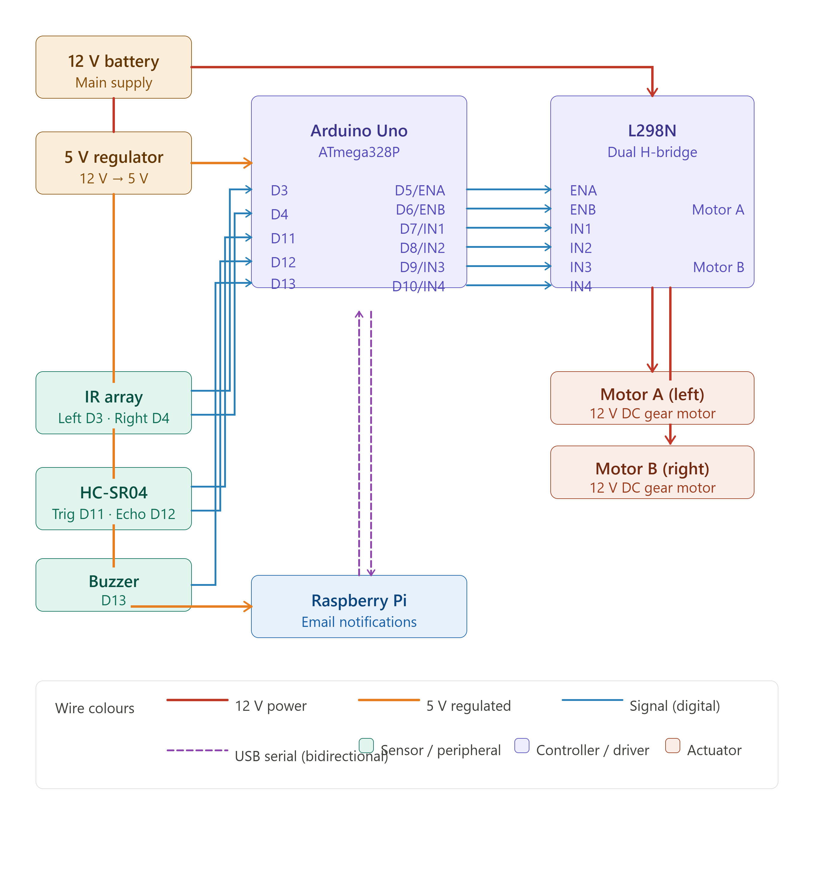

# Line Following Delivery Rover


An autonomous line-following delivery rover built for closed-environment use (e.g. within a university building). The rover follows a black line to a destination, detects whether a package has been loaded or unloaded via an ultrasonic sensor, and notifies via email through a Raspberry Pi. Achieved a grade of **1.3** at university.

---

## Overview

The system is split across two controllers:

- **Arduino Uno** — all real-time control: reading the IR sensor array, driving motors via an L298N driver, detecting load state with an HC-SR04, and receiving serial commands from the Pi.
- **Raspberry Pi** — monitors the Arduino's serial output and sends status emails (loaded, empty, started, returned) via SMTP.

The rover follows a line forward to a delivery point, waits for the package to be collected (detected by the ultrasonic sensor), then returns to the home station autonomously.

---

## Hardware

| Component | Details |
|---|---|
| Microcontroller | Arduino Uno |
| Single-board computer | Raspberry Pi 3 |
| IR sensor array | 2-channel digital, pins D3 & D4 |
| Ultrasonic sensor | HC-SR04, trigger D11 / echo D12 |
| Motor driver | L298N dual H-bridge |
| Motors | 2× DC gear motors |
| Buzzer | Passive buzzer, D13 |
| Power | 12 V battery → motors; 12 V → 5 V regulator → Arduino + Pi |
| Chassis | 4-wheel differential drive, acrylic sheet frame |

---

## Wiring



| Wire colour | Meaning |
|---|---|
| Red | 12 V power |
| Orange | 5 V regulated |
| Blue | Digital signal |
| Purple dashed | USB serial (Pi ↔ Arduino) |

**Summary:**
- IR array → Arduino D3, D4
- HC-SR04 → Arduino D11 (trig), D12 (echo)
- Buzzer → Arduino D13
- Arduino D5–D10 → L298N (ENA, ENB, IN1–IN4)
- L298N → DC motors (12 V drive rail)
- 12 V battery → L298N motor supply directly
- 12 V battery → 5 V regulator → Arduino Vin + Raspberry Pi USB

---

## Pin Reference

| Pin | Function |
|---|---|
| D3 | IR sensor — left |
| D4 | IR sensor — right |
| D5 (ENA) | Motor A speed (PWM) |
| D6 (ENB) | Motor B speed (PWM) |
| D7 (IN1) | Motor A direction |
| D8 (IN2) | Motor A direction |
| D9 (IN3) | Motor B direction |
| D10 (IN4) | Motor B direction |
| D11 | HC-SR04 trigger |
| D12 | HC-SR04 echo |
| D13 | Buzzer |

---

## Software

### Arduino (`Arduino/Rover_linefollower.ino`)

The sketch runs a state machine with three modes, controlled via serial commands from the Pi:

**Forward line following**
Reads two IR sensors. Both on line → straight ahead. Left only → steer right. Right only → steer left. Both off → stop.

**Return mode**
Reverses along the line back to the home station. Both sensors reading black simultaneously = stop-line detected; motors halt and buzzer beeps.

**Load detection**
The HC-SR04 polls continuously. An object within 15 cm for more than 300 ms (debounced) triggers `ROVER LOADED` over serial; removal triggers `ROVER EMPTY`. The Pi picks these up and sends email notifications.

**Serial commands**

| Command | Action |
|---|---|
| `S` | Start line following |
| `F` | Emergency stop |
| `R` | Activate return mode |

**Serial output (read by Pi)**

| Message | Meaning |
|---|---|
| `ROVER LOADED` | Package detected (debounced) |
| `ROVER EMPTY` | Package removed |
| `STARTED` | Forward run begun |
| `STOPPED` | Emergency stop executed |
| `RETURN MODE ACTIVATED` | Return run begun |
| `RETURNED TO STATION` | Home stop-line detected |

Motor speeds are set via constants at the top of the sketch (`MOTOR_SPEED = 155`, `MOTOR_TURN_SPEED = 190` out of 255) and can be tuned for your surface and motors.

### Raspberry Pi (`pi/rover_monitor.py`)

Connects to the Arduino over USB serial at 9600 baud. Reads status strings and sends email notifications via SMTP. Also sends `S` and `R` commands to trigger delivery and return cycles.

> Pi script to be added.

---

## Usage

1. Flash `Arduino/Rover_linefollower.ino` to the Arduino via the Arduino IDE.
2. Place the rover at the start of the line.
3. Power on — the Pi sends `S` to start, or send it manually via serial monitor.
4. The rover follows the line to the destination and stops when both sensors leave the line.
5. Place a package — the ultrasonic sensor detects it and the Pi sends a "loaded" notification.
6. Remove the package — the Pi sends `R` to trigger the return journey.
7. The rover follows the line back, stops at the home station, and beeps.

---

## Repo Structure

```
├── Arduino/
│   └── Rover_linefollower.ino
├── docs/
│   └── wiring_diagram.svg
├── images/
│   └── Rover_Inside.jpg
├── pi/
│   └── rover_monitor.py        # to be added
└── README.md
```

---

## Related Projects

- [CanSat](https://github.com/Mustafa0812) — atmospheric data collection satellite capsule
- [Custom flight controllers](https://github.com/Mustafa0812) — embedded flight control firmware

---

## License

MIT
