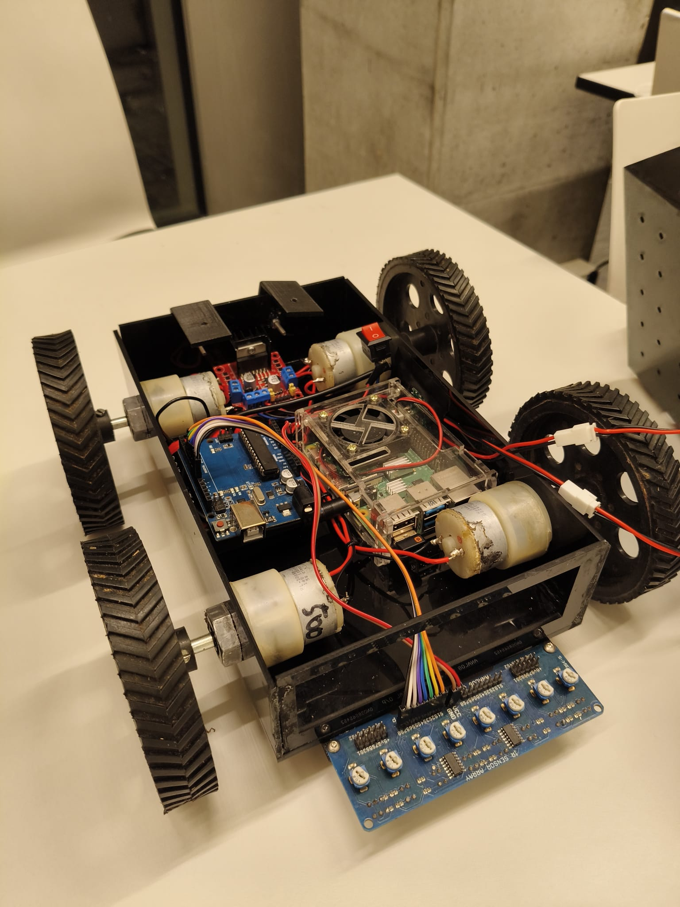

# Line Following Delivery Rover




An autonomous line-following rover built for closed-environment delivery (e.g. within a university building). The rover follows a black line to a destination, detects whether it has been loaded or unloaded via an ultrasonic sensor, and signals status back to a Raspberry Pi which sends email notifications. Achieved a grade of **1.3** at university.

---

## Overview

The system is split across two controllers:

- **Arduino Uno** — handles all real-time control: reading the IR sensor array, driving the motors via an L298N motor driver, detecting load state with an ultrasonic sensor, and receiving serial commands from the Pi.
- **Raspberry Pi** — monitors the Arduino's serial output and sends status emails (loaded, empty, started, returned) via SMTP.

The rover can follow a line forward to a delivery point, wait, detect pickup/delivery via the ultrasonic sensor, and then return to the starting station by following the line in reverse.

---

## Hardware

| Component | Details |
|---|---|
| Microcontroller | Arduino Uno |
| Single-board computer | Raspberry Pi (any model with GPIO/USB) |
| IR sensor array | 2-channel digital, pins D3 & D4 |
| Ultrasonic sensor | HC-SR04, trigger D11 / echo D12 |
| Motor driver | L298N dual H-bridge |
| Motors | 2× DC gear motors |
| Buzzer | Passive buzzer, pin D13 |
| Power | 12V battery → motors; 12V → 5V regulator → Arduino + Pi |
| Chassis | 4-wheel differential drive, 3D-printed frame |

---

## Wiring

See [`docs/wiring_diagram.svg`](docs/wiring_diagram.svg) for the full diagram.

**Summary:**
- IR array → Arduino analog/digital pins (D3, D4)
- Arduino PWM/direction pins → L298N motor driver (IN1–IN4, ENA/ENB)
- L298N output → DC motors (12V motor power rail)
- 12V battery → L298N motor supply directly
- 12V battery → voltage regulator → 5V rail → Arduino Vin + Raspberry Pi USB

---

## Pin Reference

| Pin | Function |
|---|---|
| D3 | IR sensor — left |
| D4 | IR sensor — right |
| D5 (ENA) | Motor A speed (PWM) |
| D6 (ENB) | Motor B speed (PWM) |
| D7 (IN1) | Motor A direction |
| D8 (IN2) | Motor A direction |
| D9 (IN3) | Motor B direction |
| D10 (IN4) | Motor B direction |
| D11 | Ultrasonic trigger |
| D12 | Ultrasonic echo |
| D13 | Buzzer |

---

## Software

### Arduino (`Rover-linefollower.ino`)

The sketch runs a simple state machine with three modes:

**Line following (forward)**
Reads two IR sensors. Both on line → forward. Left only → turn right. Right only → turn left. Both off → stop.

**Return mode**
Drives the motors in reverse while following the line back. Detects the home station by a full-black stop line (both sensors read black simultaneously) and halts with a buzzer beep.

**Load detection**
The HC-SR04 polls continuously. An object within 15 cm for more than 300 ms (debounced) triggers a `ROVER LOADED` serial message; absence triggers `ROVER EMPTY`. These are picked up by the Pi.

**Serial commands (from Pi)**

| Command | Action |
|---|---|
| `S` | Start line following |
| `F` | Stop (emergency) |
| `R` | Activate return mode |

**Motor speeds** are set via constants at the top of the sketch (`motorSpeed = 155`, `motorturnSpeed = 190` out of 255) and can be tuned for your surface and motor characteristics.

### Raspberry Pi

The Pi connects to the Arduino over USB serial at 9600 baud, reads the status strings printed by the Arduino, and sends email notifications via SMTP. It also sends the `S` and `R` commands to trigger delivery and return cycles.

> Pi script to be added — place in `pi/rover_monitor.py`.

---

## Usage

1. Flash `Rover-linefollower.ino` to the Arduino via the Arduino IDE.
2. Place the rover at the start of the line.
3. Power on — the Pi will send `S` to start, or send it manually over serial.
4. The rover follows the line to the destination and stops when both sensors leave the line.
5. Load the delivery item — the ultrasonic sensor detects it and the Pi sends a "loaded" notification.
6. Send `R` (via Pi or serial monitor) to trigger the return journey.
7. The rover follows the line back, stops at the home station, and beeps.

---

## Repo Structure

```
├── arduino/
│   └── Rover-linefollower.ino
├── pi/
│   └── rover_monitor.py        # (to be added)
├── docs/
│   └── wiring_diagram.svg
├── images/
│   └── rover_inside.jpg
└── README.md
```

---

## Known Issues / Notes

- The `returning` mode reads 3 sensors (`sensors[2]`) but only 2 sensor pins are defined — this is a leftover from an earlier 3-sensor design. The reverse logic still functions with 2 sensors but the stop-line detection (all three reading black) will not trigger as intended. A third sensor or updated stop detection logic would fix this.
- The buzzer beeps every loop cycle during line following (with a 1 s delay) — this was intentional for debugging but is noisy in deployment. Comment out the `beepBuzzer()` and `delay(1000)` inside the `lineFollowing` block to silence it.
- Load detection threshold (15 cm) may need tuning depending on the delivery container used.

---

## Related Projects

- **CanSat** — atmospheric data collection satellite capsule
- **Custom flight controllers** — embedded flight control firmware

---

## License

MIT
